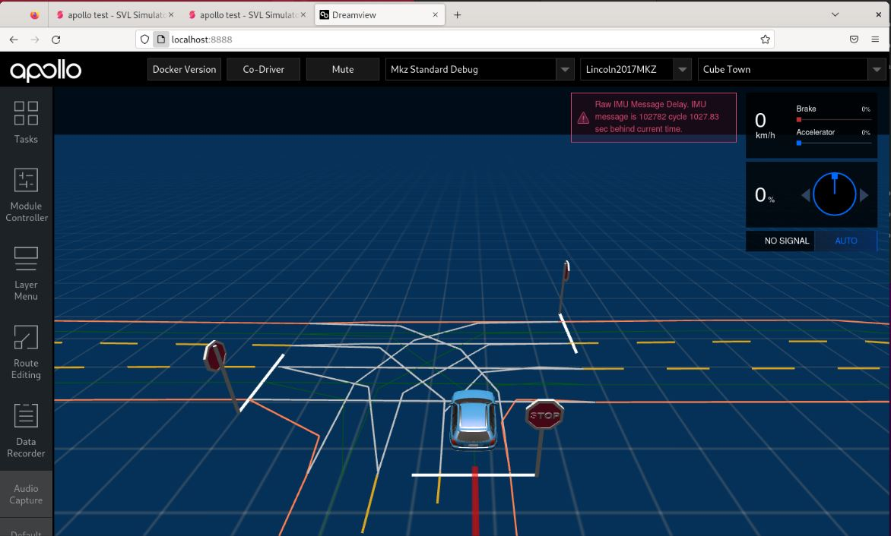
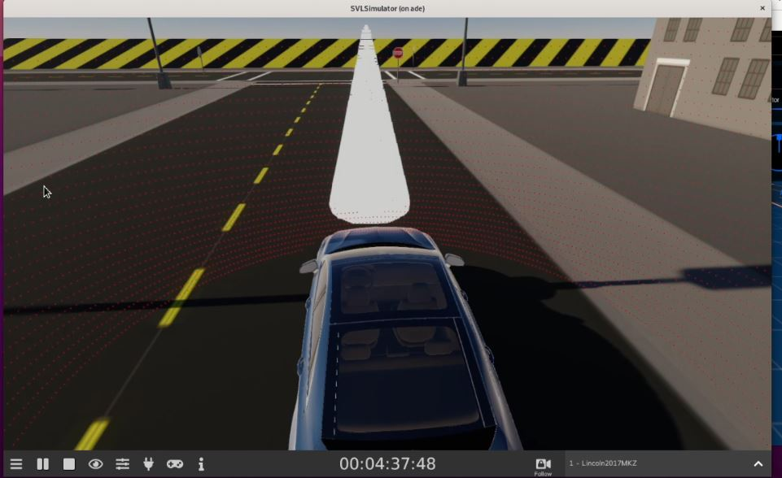
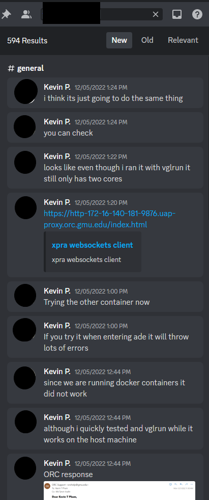

# CYSE-465-AutoWare-Project

Kevin Pham

##### Meeting for 11/12/2022

General Accomplishments and Roles:

- Lead initial setup of SVL simulator and AutoWare

- Set meeting dates

- Lead team meetings

- Communicated team roles, work assignments and general direction of the project

- Set tasks for team within each meetings

- Lead through demonstration and setup of Baidu Apollo version 5.0 with Jack Raymond

- Lead the demonstration of Baidu Apollo and LG SVL

Main tasking and contributions:

I was mostly working within the virutal machine instance. I along with my group mates continually troubleshooted and attempted new pathways with LG SVL simulator in order to attempt at gettign the autonomous driving working. While autonomous driving wasn't necessarily the key to our attack, it would've allowed us to prove the effectiveness of our attack. By having the Apollo dreamview route pointed behind the cone. If our hypothesis was correct where the cone would not be detected by LiDAR, the cone would have collided with the vehicle. 

Despite being unable to test this. The group and I were still able to observe the LiDAR point cloud seemingly passing through the cone, which indicated to us that the adversarial cone was indeed successfully avoiding the detection within the LiDAR point cloud.

Within our report. My section involved discussing the Baidu Apollo 5 install, setup, and the results of the test. This section can be found in attack implementation under header Baidu Apollo Attack.

I was a significant contributor in the discussion of our project which can be seen below:

###### Tasks for upcoming meeting on 11/15/2022:

- Conduct further testing on Autoware and become more comfortable with a software, testing out different multi-car scenarios to observe how the car behaves and also to see what changes to the scenario will cause a change in the behavior for the vehicle.

- Attempt to work with unity engine editor to observe how feasible the traffic cone implementation

- If traffic cone implementation is feasible, test traffic cone affects with the benign and attack case

- Opened team github

###### Meeting for 11/15/2022

Accomplishments for meeting on 11/15/2022

- Intermediate Autoware testing has been completed, multi-car simulations did not show any abnormal behavior, further modifications will need to be done

- Revised plan for testing:
  
  - Attempt implementation of cone attack since Jack was able to import the cone into the Unity Engine simulator

###### Accomplishments updated 11/25/22:

- Currently testing implementation of Autoware.AI autonomous driving, resources seem too scarce in order to fully utilize it, as CPU is maxed out causing the machine to freeze, even before starting the simulation on SVL simulator. 

- Storage Limit reached, attempted to expand volume so will need to contact professor

- Linux screen does not update as intended, which requires me to refresh the browser whenever I am clicking somehting on screen and it appears frozen

- Autoware.AI causing unstable machine performance, plan to switch to Baidu Apollo

###### Accomplishments updated for 11/27/22:

- Secondary volume attached but not properly showing up on machine, will need to contact ORC or professor in order to advise next move for storage

- Baidu Apollo installation failed, not enough disk storage to install docker image or create container

###### Accomplishments updated for 12/5/22:

- Secondary Volume successfully attached to a drive within the home directory

- Testing both Autoware.AI and Apollo 5.0 with new system specifications
  
  - Baidu Apollo appeared more stable with both localization and vehicle placement on the map
  
  - Autoware.AI proved to still not work correctly, as while localization issues were solved, autodriving issues still ocurred when planning a route in Rviz
  
  - Troubleshooting steps attempted but move to Baidu Apollo still confirmed

- Baidu Apollo still showed no sucess with auto driving, despite correct localization and confirmed that bridge was communication with LG SVL simulator.

###### Accomplishments updated for 12/6/22:

- Team was brought together in order to conduct video demonstration

- Baidu Apollo still did not function, which was properly explained within the video

- Adversarial cone object effectively evaded the perception of the LiDAR sensors through observing the pointcloud around the car within LG SVL.